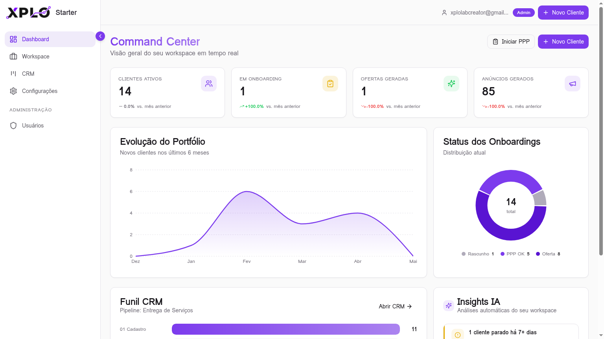
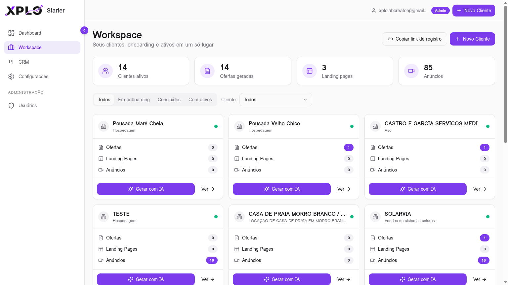
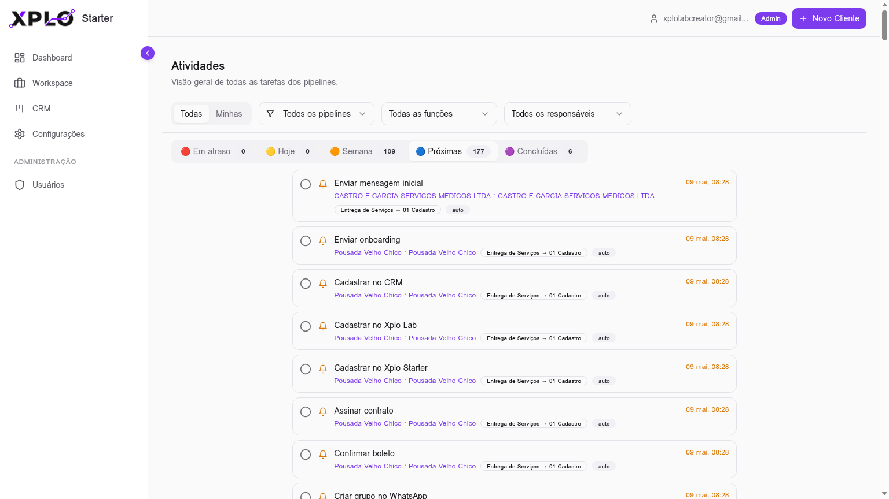
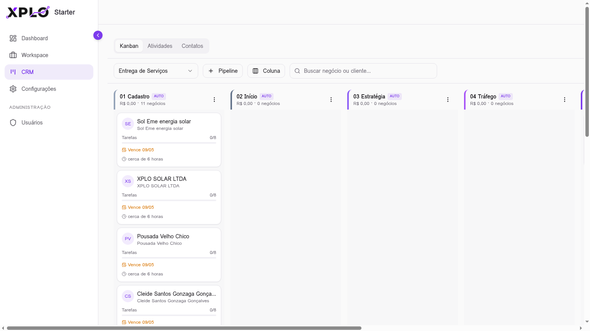

# XPLO STARTER

> Plataforma de estratégia de marketing potencializada por IA — onboarding estratégico, geração de ofertas, landing pages e anúncios, CRM Kanban e gestão completa de clientes em um único workspace.



🌐 **Produção:** [starter.xplo.com.br](https://starter.xplo.com.br)
🚀 **Stack:** React 18 · Vite · TypeScript · Tailwind · shadcn/ui · Lovable Cloud (Supabase)
🤖 **IA:** GPT-5.2 (estratégia) + Gemini 3 Flash (operações)

---

## 📋 Índice

- [Visão Geral](#-visão-geral)
- [Principais Módulos](#-principais-módulos)
- [API & MCP](#-api--mcp)
- [Arquitetura](#-arquitetura)
- [Como Rodar Localmente](#-como-rodar-localmente)
- [Estrutura do Projeto](#-estrutura-do-projeto)
- [Segurança & LGPD](#-segurança--lgpd)
- [Deploy](#-deploy)


---

## 🎯 Visão Geral

O **XPLO STARTER** é o sistema operacional de agências e consultorias de tráfego e marketing. Ele guia o estrategista por um **onboarding de 7 etapas** que extrai todo o contexto de um novo cliente (empresa, produto, mercado, ICPs, dores, promessa e revisão) e usa essa base para **gerar com IA** ofertas no estilo Hormozi, planos de demanda, landing pages completas e 16 anúncios prontos (6 vídeos modulares + 10 estáticos).

Tudo isso conectado a um **CRM Kanban** com pipelines de aquisição e entrega, automações de tarefas por checkpoint, atribuição por função operacional e badges dinâmicos de prazo.

---

## 🧩 Principais Módulos

### 1. Workspace unificado



Tela única (`/workspace`) que substituiu Clientes, Onboarding, Gerador de IA e Ativos. Mostra:

- **Tiles de resumo** — total de clientes, ofertas, landing pages e anúncios.
- **Cards de cliente** com indicador de status (🟢 X1 concluído · 🟡 em onboarding · ⚪ pendente).
- **Ações contextuais** — "Iniciar/Continuar Onboarding" ou "Gerar com IA" conforme o estágio.
- **Filtros** por status (todos · em onboarding · concluídos · com ativos).

### 2. Onboarding X1 (7 etapas estratégicas)



Wizard que constrói a base estratégica do cliente:

1. **Empresa** — dados objetivos da operação
2. **Produto** — oferta principal
3. **Mercado** — nicho, concorrência, SWOT
4. **ICPs** — 3 personas brasileiras geradas pela IA com base no contexto
5. **Dores & Desejos** — globais por cliente (não por ICP)
6. **Promessa** — equação de valor de Hormozi
7. **Revisão** — confirmação antes de liberar geração de ativos

Suporta **onboarding externo** via token (link de 7 dias) para o próprio cliente preencher.

### 3. CRM Kanban + Atividades



- **Kanban** (`/crm`) com pipelines de **Aquisição** e **Entrega** (5 checkpoints com auto-advance + coluna "Manutenção" com badges dinâmicos).
- **Atividades** (`/crm/atividades`) — visão global de tarefas com filtros por função, responsável e status (a fazer · próximas do vencimento · vencidas · feitas), com cores verde/amarelo/vermelho por prazo.
- **Contatos** (`/crm/contatos`) — tabela + import CSV.
- **Configuração** (`/crm/config`) — pipelines, tags, campos customizados e templates de tarefa.
- **Funções operacionais** — atribuição automática por `required_function` (gestor de tráfego, copywriter, designer, etc).

### 4. Geração de Ativos com IA

A partir de um onboarding concluído, a IA gera:

- **Ofertas** no estilo Hormozi (Sonho × Probabilidade ÷ Tempo × Esforço)
- **Plano de demanda** detalhado (60% Facebook Ads + funis)
- **Landing pages** com 10 seções padronizadas e versionamento
- **16 anúncios** — 6 vídeos modulares (incluindo formato "caixinha de perguntas") + 10 estáticos
- **Refinamento side-by-side** e **criação de novos vídeos via chat**
- **Webhook configurável** para exportar anúncios estáticos

### 5. Dashboard & Insights

KPIs em tempo real, funil do CRM, evolução do portfólio, donut de status de onboarding e painel de insights.

### 6. Administração

- Aprovação master para novos cadastros
- Gestão de usuários (`/admin/users`) — revogar, suspender, reset e definir senha
- Visualização de e-mails reais via edge function protegida

### 7. API REST + MCP Server

- **API REST pública** (`/functions/v1/api`) com autenticação via chaves de API (`xplo_sk_...`)
  - Endpoints: `/deals`, `/activities`, `/clients`, `/me`, `/health`
  - Escopos: `read` e `write`
  - Geração e revogação de chaves via tela de Configurações (`/settings`)
- **MCP Server** (`/functions/v1/mcp`) compatível com Model Context Protocol
  - Transporte: `StreamableHttpTransport` (JSON-RPC 2.0)
  - Tools expostas: `list_deals`, `get_deal`, `create_deal`, `update_deal`, `delete_deal`, `list_activities`, `create_activity`, `update_activity`, `list_clients`, `get_client`, `get_client_onboarding`, `start_onboarding`, `generate_icps`, `generate_promise`, `generate_pains`, `generate_swot`, `generate_offers`, `generate_demand_plan`
  - Integração pronta com Codex, Claude Desktop e outros clientes MCP
  - Configuração automática via `https://starter.xplo.com.br/mcp.json`


---

## 🏗 Arquitetura

```text
┌─────────────────────────────────────────────────────────┐
│                  Frontend (React + Vite)                │
│  Workspace · CRM · Onboarding · Dashboard · Admin       │
└─────────────────────┬───────────────────────────────────┘
                      │
        ┌─────────────┴──────────────┐
        ▼                            ▼
┌───────────────┐           ┌──────────────────┐
│ Lovable Cloud │           │   Edge Functions │
│  (Supabase)   │           │  generate-content│
│  Postgres+RLS │           │  send-webhook    │
│  Auth+Storage │           │  admin-actions   │
└───────────────┘           │  api (REST)      │
                            │  mcp (MCP Server)│
                            └─────────┬────────┘
                                      │
                            ┌─────────┴─────────┐
                            ▼                   ▼
                      ┌──────────┐       ┌──────────┐
                      │  GPT-5.2 │       │ Gemini 3 │
                      │ (Brain)  │       │  (Arm)   │
                      └──────────┘       └──────────┘
```

**Princípios:**

- **Dual AI** — GPT-5.2 para conteúdos subjetivos e estratégicos (ICPs, promessa); Gemini 3 Flash para operações em alto volume.
- **IA seletiva** — nunca usada para dados objetivos (empresa, dores), apenas para conteúdo subjetivo.
- **RLS por authenticated** em todas as tabelas; edge functions com `verify_jwt`.
- **Chaves de IA** opcionais por usuário em `user_api_keys` (fallback para infraestrutura padrão Lovable).
- **API & MCP** — autenticação independente via `api_keys` com hash SHA-256, escopos `read`/`write`, validação interna na edge function (`verify_api_key`).

---

## 🛠 Como Rodar Localmente

**Pré-requisitos:** Node.js 18+ e npm (recomendado [via nvm](https://github.com/nvm-sh/nvm)).

```sh
# 1. Clone o repositório
git clone <YOUR_GIT_URL>
cd xplo-starter

# 2. Instale as dependências
npm install

# 3. Inicie o servidor de desenvolvimento
npm run dev
```

O `.env` e o cliente Supabase são gerenciados automaticamente pela integração Lovable Cloud — não edite manualmente.

---

## 📁 Estrutura do Projeto

```text
src/
├── pages/              # Rotas (Workspace, CRM, Dashboard, Admin, Auth…)
├── components/
│   ├── workspace/      # GenerateAIDialog
│   ├── crm/            # Kanban, DealCard, Activities, Config
│   ├── onboarding/     # Wizard + 7 steps
│   ├── client/         # Detalhes, Pipeline Bar, Assets
│   ├── generator/      # Ofertas, LP, Anúncios, Refiner
│   ├── dashboard/      # KPIs, Funil, Insights
│   ├── export/         # Templates PDF
│   └── ui/             # shadcn/ui
├── hooks/              # useAuth, useCrm, useWebhook
├── lib/                # crmFormat, syncDealTasks, jobFunctions
└── integrations/supabase/  # client + types (auto-gerados)

supabase/
├── functions/          # generate-content, send-webhook, admin-user-actions…
└── config.toml
```

---

## 🔒 Segurança & LGPD

- **Light mode only** · paleta minimalista · primária `#8B5CF6`.
- **Mascarar senhas** em qualquer exibição.
- **PII protegida** — e-mails reais só via edge function autenticada.
- **RLS rigoroso** em todas as tabelas (`authenticated`).
- **Integridade referencial** — desvincular ofertas antes de remover ICPs; anúncios toleram `offer_id` nulo.
- **Aprovação master** obrigatória para novos cadastros (`xplolabcreator@gmail.com`).

---

## 🚢 Deploy

O projeto é publicado pela Lovable e atendido em **[starter.xplo.com.br](https://starter.xplo.com.br)**. Para republicar:

1. Abra o projeto na Lovable
2. Clique em **Publish** no topo direito
3. As migrations e edge functions são deployadas automaticamente

---

## 📝 Licença

Projeto proprietário XPLO LAB. Uso interno.

---

<sub>Construído com ❤ usando [Lovable](https://lovable.dev) · Estratégia movida a IA pela XPLO LAB</sub>
